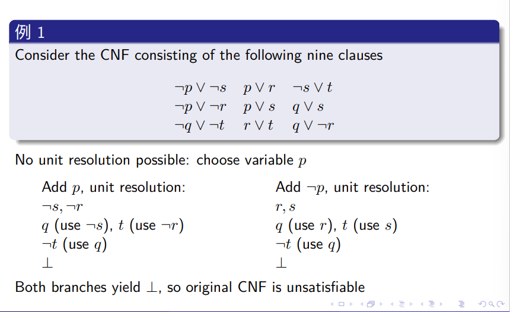

# 形式化方法导引2022SP-大作业

***

梁峻滔 PB19051175

***

[toc]

说明: 大作业内容包含两项, 分别是DPLL算法的实现和使用NuSMV进行死锁检测.

提交文件结构:

```bash
.
├── DPLL
│   ├── mysolver.py								# SAT-求解器
│   └── testcases								 # 存放测试样例
│       ├── problem.txt
│       ├── test1.txt
│       └── test2.txt
├── deadlock-detection
│   ├── dl-complicated.smv				# 复杂情形M={2, 4, 6}
│   ├── dl-complicated_2.smv     # 复杂情形M={1, 5, 9, 13}
│   └── dl-simple.smv            # 简单情形
└── report.pdf
```

测试说明:

1.   测试SAT-solver时通过命令

     ```bash
     $ python mysolver.py ./testcases/*.txt
     ```

     来输入问题和运行求解器.

2.   测试deadlock验证时通过调用NuSMV验证

     ```bash
     $ NuSMV dl-simple.smv
     ```

## 一. 基于DPLL算法的SAT求解器实现

### DPLL算法框架

```pseudocode
function DPLL(X)
    X = UNIT-RESOL(X)
    if ⊥ ∈ X then
    		return unsatisfiable
    if X = Ø then
    		return satisfiable
    if ⊥ ∉ X then
    		choose variable p in X
    		ret1 = DPLL(X ∪ {p})
    		ret2 = DPLL(X ∪ {¬p})
    		if (ret1 = satisfiable | ret2 = satisfiable) then
    				return satisfiable
    		else
    				return unsatisfiable
    				
function UNIT-RESOL(X)
		while a clause occurs in X consisting of only one literal l
				remove ¬l from all clauses in X containing ¬l
				remove all clauses containing l
```

DPLL算法思想可以概括为不断执行两种操作:

*   UnitPropagate: 存在仅由单个literal构成的clause就应用resolution.
*   Decide: 无法继续进行resolution时选择一个变量尝试赋值.

直到得出satisfiable或unsatisfiable的结果.

#### resolution

应用resolution是DPLL算法的核心之一. resolution的定义如下:


当CNF中存在仅由单个literal(形如p, ¬p)的clause时, 我们就可以应用resolution消去literal而得到语义等价的更为简洁的clause, 例如


一种终止条件:


另一种终止条件是所有的变量本身或是其否定都得到derived, 这时结果是satisfiable, 例如


### 实现过程

#### CNF的表示

程序运行过程中用一个python列表表示一个clause, 每个列表元素是字符串形式的literal: 'p'或'!p', p是原子命题. 一个CNF就是一个包含多个列表的列表.

例如(A ∨ B) ∧ (¬C ∨ D)在程序中的表示为

```python
[['A', 'B'], ['!C', 'D']]
```

#### unit-resol

后面我们称仅由单个literal构成的clause为unit.

传入一个clause集合X, 先获取X中所有unit的集合units, 对units中的每个unit应用resolution: 

*   如果 unit 形如 p (不带否定词), 则删除X中所有clause的¬p, 同时从X中删除所有含有  p 的clause.
*   如果unit 形如 ¬p, 则删除X中所有clause中的p, 同时从X中删除所有含有¬p的clause.
*   如果上述过程derive出新的unit, 则使用新的unit继续进行上述操作, 直到可以derive出⊥或者无法继续进行resolution.

在resolution的过程中记录局部的赋值情况. 具体实现如下:

```python
def unit_resol(X):
    units = get_units(X)
    if len(units) == 0:
        return {}
    # observation: a unit only can be resolved once!! 
    # unit-resolution
    local_true = set()
    local_false = set()
    while len(units) > 0:
        l = units.pop()
        if not is_negation(l): # l is an atom without nagation
            local_true.add(l)
            nl = negation(l)
            i = 0
            while True:
                if nl in X[i]:
                    X[i].remove(nl)
                elif l in X[i]:
                    X.remove(X[i])
                    i -= 1
                i += 1
                if i >= len(X):
                    break
        else: # l is a negation atom !p
            p = l[1]
            local_false.add(p)
            i = 0
            while True:
                if l in X[i]:
                    X.remove(X[i])
                    i -= 1
                elif p in X[i]:
                    X[i].remove(p)
                i += 1
                if i >= len(X):
                    break
        units = units.union(get_units(X))
        if false_derived(units):
            X.append('False')
            return {}
    
    i = 0
    if len(X) > 0: # clear empty clauses
        while True:
            if len(X[i]) == 0:
                X.remove(X[i])
                i -= 1
            i += 1
            if i >= len(X):
                break
            
    local_assignment = {}
    local_assignment['true'] = local_true
    local_assignment['false'] = local_false
    return local_assignment
```

#### DPLL主过程

```python
def dpll(cnf):
    global true_vars, false_vars
    local_assignment = unit_resol(cnf)
    if 'False' in cnf:
        return False
    elif len(cnf) == 0:
        true_vars = true_vars.union(local_assignment['true'])
        false_vars = false_vars.union(local_assignment['false'])
        return True
    else:
        cnf_bak = copy.deepcopy(cnf)
        p = choose_variable(cnf)
        new_clause = [p]
        cnf.append(new_clause)
        ret1 = dpll(cnf)
        if ret1 == True:
            true_vars = true_vars.union(local_assignment['true'])
            false_vars = false_vars.union(local_assignment['false'])
            return True
        cnf = cnf_bak
        new_clause = ['!'+p]
        cnf.append(new_clause)
        ret2 = dpll(cnf)
        if ret2 == True:
            if len(local_assignment) > 0:
                true_vars = true_vars.union(local_assignment['true'])
                false_vars = false_vars.union(local_assignment['false'])
            return True
        return False
```

### 测试

#### 输入文件约定

文件命名为'.txt', 一行表示一个clause, literal仅由一个字母或一个字母加一个'!'表示. 例如


在输入文件中应表示为

```
!p !s
p r
!s t
!p !r
p s
q s
!q !t
r t
```

#### 运行测试

1.   上述例子是satisfiable的:

     

     运行我们的求解器:

     

     求解器判定为satisfiable, 并给出了一种赋值.

2.   修改测试样例为

     

     运行我们的求解器:

     

     求解器判定为unsatisfiable.

## 二. Deadlock验证

### 1.  简单deadlock的验证

#### 模型描述

三种操作的定义:


系统组成:


#### 模型的SMV描述

```
MODULE main
    VAR
        c1: {0, 1, 2, 3, 4};
        c2: {0, 1, 2, 3, 4};
        c3: {0, 1, 2, 3, 4};
        c4: {0, 1, 2, 3, 4};
        -- 不允许给4发送消息
        pr1: process node(c4, c1, 1, {2, 3}, TRUE);
        pr2: process node(c1, c2, 2, {1, 3}, TRUE);
        pr3: process node(c2, c3, 3, {1, 2}, TRUE);
        pr4: process node(c3, c4, 4, {1, 2, 3}, FALSE);
    ASSIGN
        init(c1) := 0;
        init(c2) := 0;
        init(c3) := 0;
        init(c4) := 0;
        next(c1) := c1;
        next(c2) := c2;
        next(c3) := c3;
        next(c4) := c4;
    CTLSPEC
        -- 死锁: 某一情况下, 所有信道都不为空且所有节点均无法receive
        AG(
            !(
                (c1 != 0 & c1 != 2) & 
                (c2 != 0 & c2 != 3) & 
                (c3 != 0 & c3 != 4) & 
                (c4 != 0 & c4 != 1)
            )
        )


MODULE node(from, to, id, destinations, allowed)
    -- from: 入边上的destination
    -- to: 出边上的destination
    -- id: 节点编号
    -- destinations: 该节点允许向其发送消息的目标节点集合
    -- allowed: 指示该节点是否允许send和receive
    FAIRNESS running
    FAIRNESS !(state != idle)
    VAR
        state: {send, receive, proc, idle};
    ASSIGN
        init(state) := {idle};
        next(state) := 
            case
                (from = 0 & to = 0) : {idle, send};
                (from = 0 & to != 0) : {idle};
                (from != 0 & to = 0 & from = id) : {receive, send, idle};
                (from != 0 & to = 0 & from != id) : {proc, send, idle};
                (from != 0 & to != 0 & from = id) : {receive, idle};
                (from != 0 & to != 0 & from != id) : {idle};
                TRUE: state;
            esac;
        next(from) :=
            case
                (from = id) : 0; -- receive动作, 入边编号改为0
                (from != 0 & from != id & to = 0 & state = proc) : 0;
                TRUE: from;
            esac;
        next(to) :=
            case
                (state = send & allowed = TRUE & to = 0) : destinations; -- 如果当前状态为send, 则随机向一个node发送一条信息
                (from != 0 & from != id & to = 0 & state = proc) : from; -- 转发
                TRUE: to;
            esac;
```

#### 验证结果

```
-- specification AG !((((c1 != 0 & c1 != 2) & (c2 != 0 & c2 != 3)) & (c3 != 0 & c3 != 4)) & (c4 != 0 & c4 != 1))  is false
-- as demonstrated by the following execution sequence
Trace Description: CTL Counterexample 
Trace Type: Counterexample 
  -> State: 1.1 <-
    c1 = 0
    c2 = 0
    c3 = 0
    c4 = 0
    pr1.state = idle
    pr2.state = idle
    pr3.state = idle
    pr4.state = idle
  -> Input: 1.2 <-
    _process_selector_ = pr1
    running = FALSE
    pr4.running = FALSE
    pr3.running = FALSE
    pr2.running = FALSE
    pr1.running = TRUE
  -> State: 1.2 <-
    pr1.state = send
  -> Input: 1.3 <-
  -> State: 1.3 <-
    c1 = 3
    pr1.state = idle
  -> Input: 1.4 <-
    _process_selector_ = pr2
    pr2.running = TRUE
    pr1.running = FALSE
  -> State: 1.4 <-
    pr2.state = send
  -> Input: 1.5 <-
  -> State: 1.5 <-
    c2 = 1
    pr2.state = idle
  -> Input: 1.6 <-
    _process_selector_ = pr3
    pr3.running = TRUE
    pr2.running = FALSE
  -> State: 1.6 <-
    pr3.state = send
  -> Input: 1.7 <-
  -> State: 1.7 <-
    c3 = 2
  -> Input: 1.8 <-
    _process_selector_ = pr4
    pr4.running = TRUE
    pr3.running = FALSE
  -> State: 1.8 <-
    pr4.state = proc
  -> Input: 1.9 <-
  -> State: 1.9 <-
    c3 = 0
    c4 = 2
    pr4.state = send
  -> Input: 1.10 <-
    _process_selector_ = pr3
    pr4.running = FALSE
    pr3.running = TRUE
  -> State: 1.10 <-
    c3 = 1
    pr3.state = idle
```

对应的死锁情况为


### 2. Complicated example的验证

#### (a) 给定收发节点集M = { 2, 4, 6 }

状态裁剪:

1. 裁剪非收发节点的send和receive状态
2. 要求转发时采用最短路径, 因此可以先手动求解各种收发情况下的最短路径, 将不需要的信道和状态删除

首先计算各种收发情况下的最短路径, 有且仅有6种收发情况, 以下给出最短路径:

1. send(2, 4): 2->3->4
2. send(2, 6): 2->3->4->6
3. send(4, 2): 4->6->7->17->15->16->2
4. send(4, 6): 4->6
5. send(6, 2): 6->7->17->15->16->2
6. send(6, 4): 6->7->17->3->4

实际上在信息发送过程中根本不会涉及到其他节点, 因此可以仅考虑以上节点所构成的图, 再进一步考虑收发情况的单向性, 可以简化模型如下:


将节点分成两种类型: terminal(2, 4, 6)和inter(3, 6, 7, 17, 15, 16). 建立模型如下:

对于上述模型而言, deadlock的情形为:

* 对于一个terminal

    * 无法receive: 所有入边都没有发给自己的消息
    * 无法send: 所有出边均已被占用
    * 无法proc: 入边对应的最短路径的出边被占用

    以上必须同时成立

* 对于一个inter, 入边消息对应的最短路径的出边被占用

模型的SMV描述为

```
MODULE main
    VAR
        c1: {0, 2, 4, 6};
        c2: {0, 2, 4, 6};
        c3: {0, 2, 4, 6};
        c4: {0, 2, 4, 6};
        c5: {0, 2, 4, 6};
        c6: {0, 2, 4, 6};
        c7: {0, 2, 4, 6};
        c8: {0, 2, 4, 6};
        c9: {0, 2, 4, 6};

        pr1: process terminal(2, c9, c1, {4, 6});
        pr2: process terminal(4, c2, c3, {2, 6});
        pr3: process terminal(6, c3, c4, {2, 4});
        pr4: process node3(3, c1, c6, c2);
        pr5: process inter(7, c4, c5);
        pr6: process node17(17, c5, c6, c7);
        pr7: process inter(15, c7, c8);
        pr8: process inter(16, c8, c9);
    ASSIGN
        init(c1) := 0;
        init(c2) := 0;
        init(c3) := 0;
        init(c4) := 0;
        init(c5) := 0;
        init(c6) := 0;
        init(c7) := 0;
        init(c8) := 0;
        init(c9) := 0;
        next(c1) := c1;
        next(c2) := c2;
        next(c3) := c3;
        next(c4) := c4;
        next(c5) := c5;
        next(c6) := c6;
        next(c7) := c7;
        next(c8) := c8;
        next(c9) := c9;
    CTLSPEC
        AG(
            !(
                -- node 2 blocked
                (c9 != 2 & c1 != 0) &
                -- node 3 blocked
                (c2 != 0 & c2 !=4) &
                -- node 4 blocked
                (c3 != 0 & c2 !=4) &
                -- node 6 blocked
                (c4 != 0 & c3 != 6) &
                -- node 7 blocked
                (c5 != 0 | (c5 = 0 & c4 = 0)) &
                -- node 15 blocked
                (c8 != 0 | (c8 = 0 & c7 = 0)) &
                -- node 16 blocked
                (c9 != 0 | (c9 = 0 & c8 = 0)) &
                -- node 17 blocked
                ((c6 != 0 & (c5 = 4)) | (c7 != 0 & c5 = 2) | (c5 = 0 & c7 = 0 & c6 = 0))
            )
        )

MODULE terminal(id, from, to, destinations)
    FAIRNESS running
    FAIRNESS !(state != idle)
    VAR
        state: {idle, send, receive, proc};
    ASSIGN
        init(state) := idle;
        next(state) := 
            case
                (from = 0 & to = 0) : {idle, send};
                (from = 0 & to != 0) : {idle};
                (from != 0 & to = 0 & from = id) : {receive, send, idle};
                (from != 0 & to = 0 & from != id) : {proc, send, idle};
                (from != 0 & to != 0 & from = id) : {receive, idle};
                (from != 0 & to != 0 & from != id) : {idle};
                TRUE: state;
            esac;
        next(from) :=
            case
                (from = id) : 0; -- receive动作, 入边编号改为0
                (from != 0 & from != id & to = 0 & state = proc) : 0;
                TRUE: from;
            esac;
        next(to) :=
            case
                (state = send & to = 0) : destinations; -- 如果当前状态为send, 则随机向一个node发送一条信息
                (from != 0 & from != id & to = 0 & state = proc) : from; -- 转发
                TRUE: to;
            esac;


MODULE inter(id, from, to)
    FAIRNESS running
    FAIRNESS !(state != idle)
    VAR
        -- 中间节点只有转发功能, 没有send和receive
        state: {idle, proc};
    ASSIGN
        init(state) := idle;
        next(state) := 
            case
                (from != 0 & to = 0 & from != id) : {proc, idle};
                TRUE: idle;
            esac;
        next(from) :=
            case
                -- 转发, from置成0
                (from != 0 & from != id & to = 0 & state = proc) : 0;
                TRUE: from;
            esac;
        next(to) :=
            case
                -- 转发, 将to置成from的值
                (from != 0 & from != id & to = 0 & state = proc) : from; -- 转发
                TRUE: to;
            esac;

MODULE node17(id, from7, to3, to15)
    FAIRNESS running
    FAIRNESS !(state != idle)
    VAR
        -- 中间节点只有转发功能, 没有send和receive
        state: {idle, proc};
    ASSIGN
        init(state) := idle;
        next(state) := 
            case
                (from7 = 2 & to15 = 0) : {proc, idle};
                (from7 = 4 & to3 = 0) : {proc, idle};
                TRUE: idle;
            esac;
        next(from7) :=
            case
                -- 转发, from置成0
                (from7 = 2 & to15 = 0 & state = proc) : 0;
                (from7 = 4 & to3 = 0 & state = proc) : 0;
                TRUE: from7;
            esac;
        next(to3) :=
            case
                -- 转发, 将to置成from的值
                (from7 = 4 & to3 = 0 & state = proc) : from7; -- 向node3转发
                TRUE: to3;
            esac;
        next(to15) :=
            case
                (from7 = 2 & to15 = 0 & state = proc) : from7; -- 向node15转发
                TRUE: to15;
            esac;

MODULE node3(id, from2, from17, to4)
    FAIRNESS running
    FAIRNESS !(state != idle)
    VAR
        -- 中间节点只有转发功能, 没有send和receive
        state: {idle, proc};
    ASSIGN
        init(state) := idle;
        next(state) := 
            case
                (((from2 != 0 & from2 != id)| (from17 != 0 & from17 != id)) & to4 = 0) : {proc, idle};
                TRUE: idle;
            esac;
        next(from2) :=
            case
                -- 转发, from置成0
                (from2 != 0 & from2 != id & to4 = 0 & state = proc) : 0;
                TRUE: from2;
            esac;
        next(from17) :=
            case
                -- 转发, from置成0
                (from2 = 0 & from17 != 0 & from17 != id & to4 = 0 & state = proc) : 0;
                TRUE: from17;
            esac;
        next(to4) :=
            case
                (from2 != 0 & from2 != id & to4 = 0 & state = proc) : from2;
                (from2 = 0 & from17 != 0 & from17 != id & to4 = 0 & state = proc) : from17;
                TRUE: to4;
            esac;

```

验证结果

```
-- specification AG !((((((((c9 != 2 & c1 != 0) & (c2 != 0 & c2 != 4)) & (c3 != 0 & c2 != 4)) & (c4 != 0 & c3 != 6)) & (c5 != 0 | (c5 = 0 & c4 = 0))) & (c8 != 0 | (c8 = 0 & c7 = 0))) & (c9 != 0 | (c9 = 0 & c8 = 0))) & (((c6 != 0 & c5 = 4) | (c7 != 0 & c5 = 2)) | ((c5 = 0 & c7 = 0) & c6 = 0)))  is false
-- as demonstrated by the following execution sequence
Trace Description: CTL Counterexample 
Trace Type: Counterexample 
  -> State: 1.1 <-
    c1 = 0
    c2 = 0
    c3 = 0
    c4 = 0
    c5 = 0
    c6 = 0
    c7 = 0
    c8 = 0
    c9 = 0
    pr1.state = idle
    pr2.state = idle
    pr3.state = idle
    pr4.state = idle
    pr5.state = idle
    pr6.state = idle
    pr7.state = idle
    pr8.state = idle
  -> Input: 1.2 <-
    _process_selector_ = pr1
    running = FALSE
    pr8.running = FALSE
    pr7.running = FALSE
    pr6.running = FALSE
    pr5.running = FALSE
    pr4.running = FALSE
    pr3.running = FALSE
    pr2.running = FALSE
    pr1.running = TRUE
  -> State: 1.2 <-
    pr1.state = send
  -> Input: 1.3 <-
  -> State: 1.3 <-
    c1 = 6
  -> Input: 1.4 <-
    _process_selector_ = pr2
    pr2.running = TRUE
    pr1.running = FALSE
  -> State: 1.4 <-
    pr2.state = send
  -> Input: 1.5 <-
  -> State: 1.5 <-
    c3 = 2
  -> Input: 1.6 <-
    _process_selector_ = pr3
    pr3.running = TRUE
    pr2.running = FALSE
  -> State: 1.6 <-
    pr3.state = send
  -> Input: 1.7 <-
  -> State: 1.7 <-
    c4 = 4
  -> Input: 1.8 <-
    _process_selector_ = pr5
    pr5.running = TRUE
    pr3.running = FALSE
  -> State: 1.8 <-
    pr5.state = proc
  -> Input: 1.9 <-
  -> State: 1.9 <-
    c4 = 0
    c5 = 4
  -> Input: 1.10 <-
    _process_selector_ = pr3
    pr5.running = FALSE
    pr3.running = TRUE
  -> State: 1.10 <-
    c4 = 4
  -> Input: 1.11 <-
    _process_selector_ = pr6
    pr6.running = TRUE
    pr3.running = FALSE
  -> State: 1.11 <-
    pr6.state = proc
  -> Input: 1.12 <-
  -> State: 1.12 <-
    c5 = 0
    c6 = 4
    pr6.state = idle
  -> Input: 1.13 <-
    _process_selector_ = pr5
    pr6.running = FALSE
    pr5.running = TRUE
  -> State: 1.13 <-
    c4 = 0
    c5 = 4
    pr5.state = idle
  -> Input: 1.14 <-
    _process_selector_ = pr3
    pr5.running = FALSE
    pr3.running = TRUE
  -> State: 1.14 <-
    c4 = 2
  -> Input: 1.15 <-
    _process_selector_ = pr4
    pr4.running = TRUE
    pr3.running = FALSE
  -> State: 1.15 <-
    pr4.state = proc
  -> Input: 1.16 <-
  -> State: 1.16 <-
    c1 = 0
    c2 = 6
    pr4.state = idle
  -> Input: 1.17 <-
    _process_selector_ = pr1
    pr4.running = FALSE
    pr1.running = TRUE
  -> State: 1.17 <-
    c1 = 4
    pr1.state = idle
```

#### (b) 给定收发节点集M = { 1, 5, 9, 13 } 

计算各种收发情况下的的最短路径:

1. send(1, 5): 1->2->3->4->5
2. send(1, 9): 1->2->3->17->7->8->9
3. send(1, 13): 1->2->3->17->11->12->13
4. send(5, 1): 5->6->7->17->15->16->1
5. send(5, 9): 5->6->7->8->9
6. send(5, 13): 5->6->7->17->11->12->13
7. send(9, 1): 9->10->11->17->15->16->1
8. send(9, 5): 9->10->11->17->3->4->5
9. send(9, 13): 9->10->11->12->13
10. send(13, 1): 13->14->15->16->1
11. send(13, 5): 13->14->15->17->3->4->5
12. send(13, 9): 13->14->15->17->7->8->9

保留涉及到的节点可得如下模型:


删除2, 4, 6等中间节点, 可得如下简化模型:


简化模型中节点可分为3种: 收发节点, 中间节点(17)以及除了中间节点之外的转发节点. 简化模型中各收发情况对应的路径为:

1. send(1, 5): 1->3->5
2. send(1, 9): 1->3->17->7->9
3. send(1, 13): 1->3->17->11->13
4. send(5, 1): 5->7->17->15->1
5. send(5, 9): 5->7->9
6. send(5, 13): 5->7->17->11->13
7. send(9, 1): 9->11->17->15->1
8. send(9, 5): 9->11->17->3->5
9. send(9, 13): 9->11->13
10. send(13, 1): 13->15->1
11. send(13, 5): 13->15->17->3->5
12. send(13, 9): 13->15->17->7->9

经过中心节点17的只有以下情形:

1. 3->17->7
2. 3->17->11
3. 7->17->15
4. 7->17->11
5. 11->17->15
6. 11->17->3
7. 15->17->3
8. 15->17->7

在建模时需要枚举这8种情形.

模型的SMV描述

```
MODULE main
    VAR
        c1: {0, 1, 5, 9, 13};
        c2: {0, 1, 5, 9, 13};
        c3: {0, 1, 5, 9, 13};
        c4: {0, 1, 5, 9, 13};
        c5: {0, 1, 5, 9, 13};
        c6: {0, 1, 5, 9, 13};
        c7: {0, 1, 5, 9, 13};
        c8: {0, 1, 5, 9, 13};
        c9: {0, 1, 5, 9, 13};
        c10: {0, 1, 5, 9, 13};
        c11: {0, 1, 5, 9, 13};
        c12: {0, 1, 5, 9, 13};

        pr1: process terminal(1, c8, c1, {5, 9, 13});
        pr2: process terminal(5, c2, c3, {1, 9, 13});
        pr3: process terminal(9, c4, c5, {1, 5, 13});
        pr4: process terminal(13, c6, c7, {1, 5, 9});
        pr5: process center(17, c10, c11, c12, c9);
        pr6: process inter(3, c1, c2, c10, 5, 9, 13);
        pr7: process inter(7, c3, c4, c11, 9, 1, 13);
        pr8: process inter(11, c5, c6, c12, 13, 1, 5);
        pr9: process inter(15, c7, c8, c9, 1, 5, 9);
    ASSIGN
        init(c1) := 0;
        init(c2) := 0;
        init(c3) := 0;
        init(c4) := 0;
        init(c5) := 0;
        init(c6) := 0;
        init(c7) := 0;
        init(c8) := 0;
        init(c9) := 0;
        init(c10) := 0;
        init(c11) := 0;
        init(c12) := 0;
        next(c1) := c1;
        next(c2) := c2;
        next(c3) := c3;
        next(c4) := c4;
        next(c5) := c5;
        next(c6) := c6;
        next(c7) := c7;
        next(c8) := c8;
        next(c9) := c9;
        next(c10) := c10;
        next(c11) := c11;
        next(c12) := c12;
    CTLSPEC
        AG(
            !(
                -- node1 blocked
                (c1 != 0 & c8 != 1) &
                -- node5 blocked
                (c3 != 0 & c2 != 5) &
                -- node9 blocked
                (c5 != 0 & c4 != 9) &
                -- node13 blocked
                (c7 != 0 & c6 != 13) &
                -- node3 blocked
                ((c1=0&c2=0&c10=0)&(c1=5&c2!=0)&(((c1=9)|(c1=13))&c10!=0)&(c10=5&c2!=0))&
                -- node7 blocked
                ((c3=0&c4=0&c11=0)&(c3=9&c4!=0)&(((c3=1)|(c3=13))&c11!=0)&(c11=9&c4!=0))&
                -- node11 blocked
                ((c5=0&c6=0&c12=0)&(c5=13&c6!=0)&(((c5=1)|(c5=5))&c12!=0)&(c12=13&c6!=0))&
                -- node15 blocked
                ((c7=0&c8=0&c9=0)&(c7=1&c8!=0)&(((c7=5)|(c7=9))&c9!=0)&(c9=1&c8!=0))&
                -- node17 blocked
                ((c10=9|c9=9)&c11!=0)&((c10=13|c11=13)&c12!=0)&((c11=1|c12=1)&c9!=0)&((c9=5|c12=5)&c10!=0)
            )
        )


MODULE terminal(id, from, to, destinations)
    FAIRNESS running
    FAIRNESS !(state != idle)
    VAR
        state: {idle, send, receive, proc};
    ASSIGN
        init(state) := idle;
        next(state) := 
            case
                (from = 0 & to = 0) : {idle, send};
                (from = 0 & to != 0) : {idle};
                (from != 0 & to = 0 & from = id) : {receive, send, idle};
                (from != 0 & to = 0 & from != id) : {proc, send, idle};
                (from != 0 & to != 0 & from = id) : {receive, idle};
                (from != 0 & to != 0 & from != id) : {idle};
                TRUE: state;
            esac;
        next(from) :=
            case
                (from = id) : 0; -- receive动作, 入边编号改为0
                (from != 0 & from != id & to = 0 & state = proc) : 0;
                TRUE: from;
            esac;
        next(to) :=
            case
                (state = send & to = 0) : destinations; -- 如果当前状态为send, 则随机向一个node发送一条信息
                (from != 0 & from != id & to = 0 & state = proc) : from; -- 转发
                TRUE: to;
            esac;


MODULE center(id, dinout_e, dinout_s, dinout_w, dinout_n)
    -- 有四个双向可进可出端口
    FAIRNESS running
    FAIRNESS !(state = idle)
    VAR
        state : {idle, proc1, proc2, proc3, proc4, proc5, proc6, proc7, proc8};
    ASSIGN
        init(state) := idle;
        next(state) :=
            case
                -- proc1: 3->17->7
                (dinout_n = 9 & dinout_e = 0) : proc1;
                -- proc2: 3->17->11
                (dinout_n = 13 & dinout_s = 0) : proc2;
                -- proc3: 7->17->15
                (dinout_e = 1 & dinout_w = 0) : proc3;
                -- proc4: 7->17->11
                (dinout_e = 13 & dinout_s = 0) : proc4;
                -- proc5: 11->17->15
                (dinout_s = 1 & dinout_w = 0) : proc5;
                -- proc6: 11->17->3
                (dinout_s = 5 & dinout_n = 0) : proc6;
                -- proc7: 15->17->3
                (dinout_w = 5 & dinout_n = 0) : proc7;
                -- proc8: 15->17->7
                (dinout_w = 9 & dinout_e = 0) : proc8;
                TRUE: idle;
            esac;
        next(dinout_e) :=
            case
                (state = proc1) : 9;
                (state = proc3) : 0;
                (state = proc4) : 0;
                (state = proc8) : 9;
                TRUE: dinout_e;
            esac;
        next(dinout_s) :=
            case
                (state = proc2) : 13;
                (state = proc4) : 13;
                (state = proc5) : 0;
                (state = proc6) : 0;
                TRUE: dinout_s;
            esac;
        next(dinout_w) :=
            case
                (state = proc3) : 1;
                (state = proc5) : 1;
                (state = proc7) : 0;
                (state = proc8) : 0;
                TRUE: dinout_w;
            esac;
        next(dinout_n) :=
            case
                (state = proc1) : 0;
                (state = proc2) : 0;
                (state = proc6) : 5;
                (state = proc7) : 5;
                TRUE: dinout_n;
            esac;

MODULE inter(id, sin, sout, dinout, dest1, dest2, dest3)
    -- 一个单向入口, 一个单向出口和一个双向可进可出端口
    -- dest1不需要向中心节点转发
    -- dest2和dest3需要向中心节点转发
    FAIRNESS running
    FAIRNESS !(state = idle)
    VAR
        -- proc1表示从sin转发到sout或者从sin转发到dinout
        -- proc2表示从dinout转发到sout
        state : {idle, proc1, proc2};
    ASSIGN
        init(state) := idle;
        next(state) :=
            case
                (sin != 0 & ((sin = dest1 & sout = 0) | ((sin = dest2 | sin = dest3) & dinout = 0))) : proc1;
                (dinout != 0 & sout = 0) : proc2;
                TRUE: idle;
            esac;
        next(sin) :=
            case
                (sin != 0 & ((sin = dest1 & sout = 0) | ((sin = dest2 | sin = dest3) & dinout = 0))) : 0;
                TRUE: sin;
            esac;
        next(sout) :=
            case
                (sin != 0 & (sin = dest1 & sout = 0) & state = proc1) : sin;
                (dinout != 0 & sout = 0 & state = proc2) : dinout;
                TRUE: sout;
            esac;
        next(dinout) :=
            case
                (sin != 0 & ((sin = dest2 | sin = dest3) & dinout = 0) & state = proc1) : sin;
                TRUE: dinout;
            esac;
```

验证结果: 理论上验证结果应为true(不会发生死锁), 但是由于状态空间还是过大, 无法在有效时间内运行出结果. 由于时间和精力有限, 暂时未能做进一步优化来实现验证.

